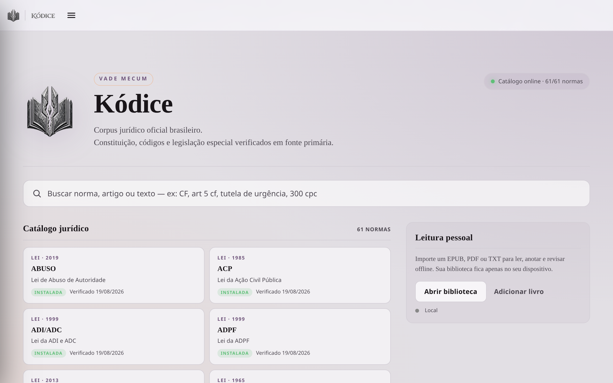
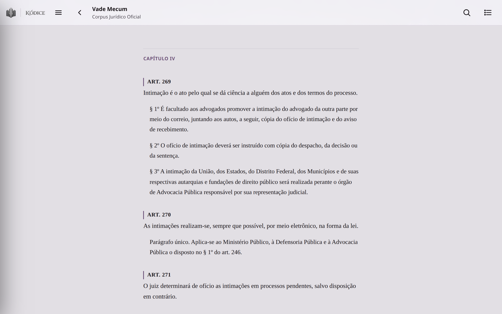
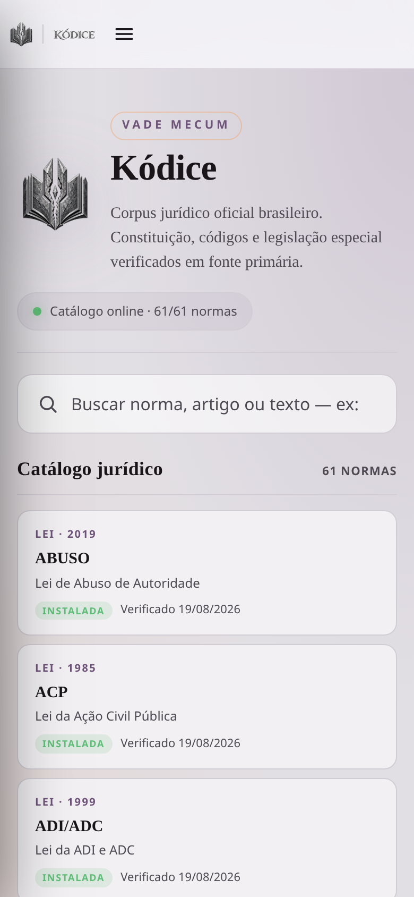

# Kódice

> **Local-first reader and reproducible Brazilian legal corpus — EPUB/PDF/TXT, PWA, Vade Mecum, deterministic search and SQLite.**

[](https://github.com/NomosLudens/kodice/actions/workflows/ci.yml)
[](https://kodice.nomosludens.ia.br)
[](docs/LEGAL-CORPUS.md)
[](docs/ARCHITECTURE.md)

---

## Demonstração Online

* **Aplicação Web (PWA):** [https://kodice.nomosludens.ia.br](https://kodice.nomosludens.ia.br)
* **API Jurídica Pública:** [https://api.kodice.nomosludens.ia.br](https://api.kodice.nomosludens.ia.br)

---

## Visão Geral

O **Kódice** combina um leitor tipográfico e multipropósito de alta fidelidade para livros pessoais (**EPUB**, **PDF** e **TXT**) com uma infraestrutura completa de consulta jurídica estruturada (**Vade Mecum** nativo com 61 normas e 36.045 artigos/unidades normativas do direito brasileiro).

Tudo é construído sob os princípios de **privacidade integral**, **desacoplamento** e **reprodutibilidade determinística**: seus livros pessoais e notas nunca saem do seu dispositivo, e o corpus jurídico pode ser rematerializado e auditado a partir das fontes declarativas com um único comando.



<p align="center">
  
  
</p>

---

## Principais Recursos

* **Vade Mecum Jurídico Integrado:**
  * 61 diplomas normativos federais fundamentais (CF/88, CPC/2015, CC/2002, CP, CPP, CLT, CTN, CDC, LGPD, etc.).
  * Resolução determinística e instantânea de citações (ex.: digitar `cpc 300` ou `cf 5` navega diretamente para o texto consolidado).
  * Leitura contínua em formato adaptativo e tipografia desenhada para concentração jurídica.
* **Leitor de Múltiplos Formatos:**
  * **EPUB:** Navegação paginada e contínua (EPUB.js), com suporte a notas inline e temas claro/escuro.
  * **PDF:** Visualizador de alta precisão executado em Web Worker com PDF.js, sem travamento da thread principal da interface.
  * **TXT:** Modo texto limpo e legível com controles de espaçamento, margem e fonte.
* **Privacidade e Arquitetura Local-First:**
  * Armazenamento de livros, posições de leitura e anotações 100% no cliente via IndexedDB.
  * Não depende de conexão após a primeira abertura (PWA com Service Worker precache).
  * Sincronização opcional com Supabase (para usuários que desejam manter progresso entre aparelhos).
* **Camada de Dados Reproduzível e Verificável:**
  * Materialização do banco SQLite a partir do corpus JSON declarativo em `< 3s`.
  * Verificação criptográfica do hash lógico canônico de todas as normas e unidades.

---

## Início Rápido (Reprodução em 3 Passos)

O Kódice não exige contas externas, chaves privadas ou bancos proprietários para execução completa local.

### 1. Clonar e Instalar

```bash
git clone https://github.com/NomosLudens/kodice.git
cd kodice

bun install --frozen-lockfile
```

### 2. Verificar a Reprodutibilidade

Execute a verificação determinística de integridade do banco SQLite, testes de fronteiras e build do frontend:

```bash
bun run reproduce:verify
```

Saída esperada:
```text
NORMS:        61
UNITS:        36045
LOGICAL_HASH: 7e09b098072983fb87854e5e2fcceed809bde308069e37b454b07e4d15aa512f
```

### 3. Executar o Ambiente Completo

Inicie simultaneamente o backend da API jurídica e o frontend do leitor:

```bash
bun run dev:full
```

Acesse:
* **Frontend:** [http://localhost:5173](http://localhost:5173)
* **API Jurídica:** [http://127.0.0.1:4520/api/legal/catalog](http://127.0.0.1:4520/api/legal/catalog)

---

## Documentação Técnica

* [Arquitetura do Sistema](docs/ARCHITECTURE.md) — Diagrama de componentes, isolamento de dados e fluxos de execução.
* [Guia de Reprodutibilidade](docs/REPRODUCIBILITY.md) — Instruções detalhadas de auditoria, testes e reconstrução.
* [Corpus Jurídico Canônico](docs/LEGAL-CORPUS.md) — Relação das 61 normas, esquemas JSON e integridade.
* [Manual de Implantação](docs/DEPLOYMENT.md) — Topologia Cloudflare Pages, Cloudflare Tunnel e Systemd.
* [PWA e Dispositivos Móveis](docs/PWA_MOBILE.md) — Guia de instalação no iOS e Android, modo offline e armazenamento.
* [Diretrizes de Segurança](SECURITY.md) — Práticas de segurança, CSP e canal de relato de vulnerabilidades.
* [Guia de Contribuição](CONTRIBUTING.md) — Normas de submissão e fluxo de desenvolvimento.

---

## Licença

No explicit open-source license has been selected yet. All rights reserved.
