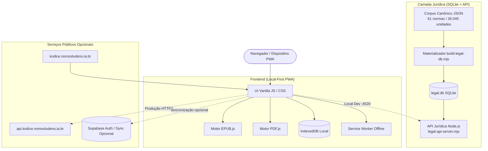

# Kódice — Arquitetura do Sistema

O **Kódice** é uma plataforma de leitura e pesquisa jurídica estruturada sob os princípios de **local-first**, determinismo e reprodutibilidade integral.



---

## 1. Frontend (Web & PWA)

* **Tecnologia:** HTML5 / CSS3 / JavaScript Vanilla moderno (empacotado via Vite).
* **Execução:** 100% no cliente. Inicializa sem necessidade de credenciais ou rede ativa após o primeiro carregamento.
* **Leitores Especializados:**
  * **Vade Mecum Jurídico:** Leitor contínuo navegável por artigos, parágrafos, incisos e alíneas, com resolução determinística de citações (ex.: `cpc 300`, `cf 5`).
  * **EPUB:** Renderizador paginado/contínuo baseado em EPUB.js com suporte a notas de rodapé inline e anotações.
  * **PDF:** Visualizador de alta precisão com PDF.js em Web Worker dedicado, com renderização vetorial e suporte a zoom adaptativo.
  * **TXT:** Modo tipográfico para leitura e estudo.
* **Armazenamento:** IndexedDB nativo do navegador para biblioteca de livros, anotações, destaques e histórico de leitura.
* **Sincronização Opcional:** Suporte nativo ao Supabase para sincronização cross-device de notas e progresso (estritamente opcional).

---

## 2. Camada Jurídica (Corpus & SQLite)

* **Corpus Declarativo:** 61 normas jurídicas brasileiras fundamentais (CF/88, códigos substantivos e processuais, leis complementares e estatutos) codificadas em formato JSON padronizado e validado semanticamente em `legal/corpus/`.
* **Banco SQLite:** O script `scripts/build-legal-db.mjs` materializa deterministicamente o corpus no banco SQLite `legal.db` em menos de 3 segundos:
  * **61** normas (`legal_norms`)
  * **61** versões com hashes de proveniência (`legal_versions`)
  * **36.045** unidades jurídicas hierarquizadas (`legal_units`)
* **Hash Lógico Canônico:** A integridade de todo o corpus é garantida pelo hash SHA-256 lógico de suas tabelas e ordenações:
  ```
  7e09b098072983fb87854e5e2fcceed809bde308069e37b454b07e4d15aa512f
  ```
* **API Jurídica:** Servidor HTTP nativo Node.js (`scripts/legal-api-server.mjs`) que expõe catálogo, metadados normativos, busca textual e recuperação instantânea de unidades jurídicas por caminho canônico.

---

## 3. Isolamento e Desacoplamento

* **Sem Credenciais Privadas:** O repositório não contém tokens, credenciais de infraestrutura ou chaves privadas.
* **Zero Dependência de Infraestrutura Proprietária:** O aplicativo funciona de forma autônoma sem necessitar de Tailscale, servidores internos ou serviços comerciais.
* **CORS & Políticas de Rede:** A API jurídica aceita origens locais e os domínios canônicos do projeto, permitindo extensões por variáveis de ambiente (`KODICE_ALLOWED_ORIGINS`).
