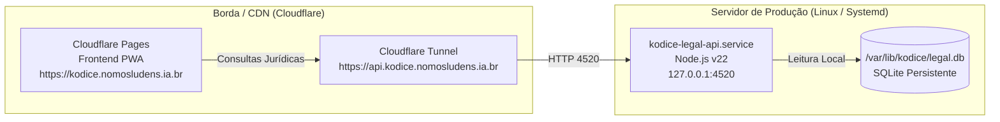

# Kódice — Arquitetura de Implantação e Operação

Este documento documenta o modelo de implantação em produção do **Kódice**, cobrindo o frontend estático e a API jurídica.

---

## 1. Topologia de Produção

---

## 2. Frontend (Cloudflare Pages)

* **Build:** `npm run build` ou `bun run build`.
* **Saída:** Diretório `dist/`.
* **Headers de Segurança (`dist/_headers`):**
  * Content Security Policy (CSP) estrita com origens exclusivas para o domínio canônico e Supabase.
  * Sem exposição de hosts privados ou rede interna.

---

## 3. Backend (Systemd & SQLite)

* **Serviço:** `kodice-legal-api.service`
* **Local de Execução:** `/srv/kodice`
* **Banco de Dados:** `/var/lib/kodice/legal.db` (permissões restritas)
* **Porta:** `127.0.0.1:4520`
* **Política de Deploy (Staging e Cutover Atômico):**
  1. Criação de release limpa a partir de commit auditado.
  2. Validação prévia em porta de staging paralela (`:4521`).
  3. Comprovação da integridade do banco SQLite antes e depois do cutover.
  4. Substituição atômica do runtime e reinicialização com rollback garantido (N+1).
